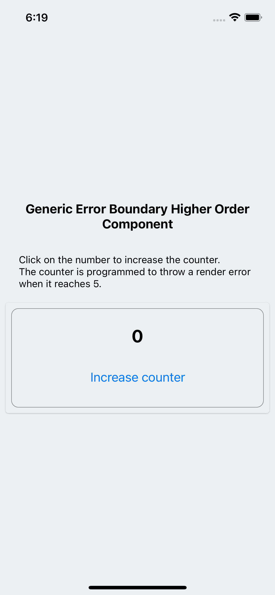
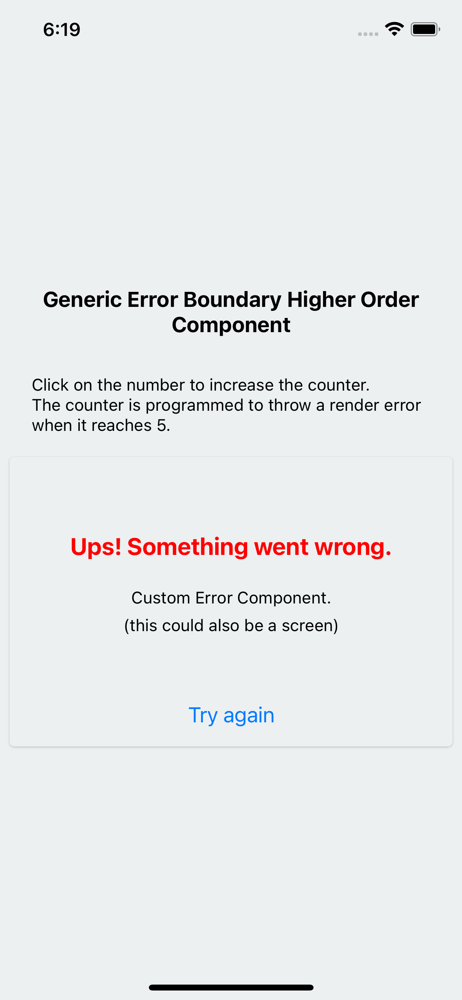
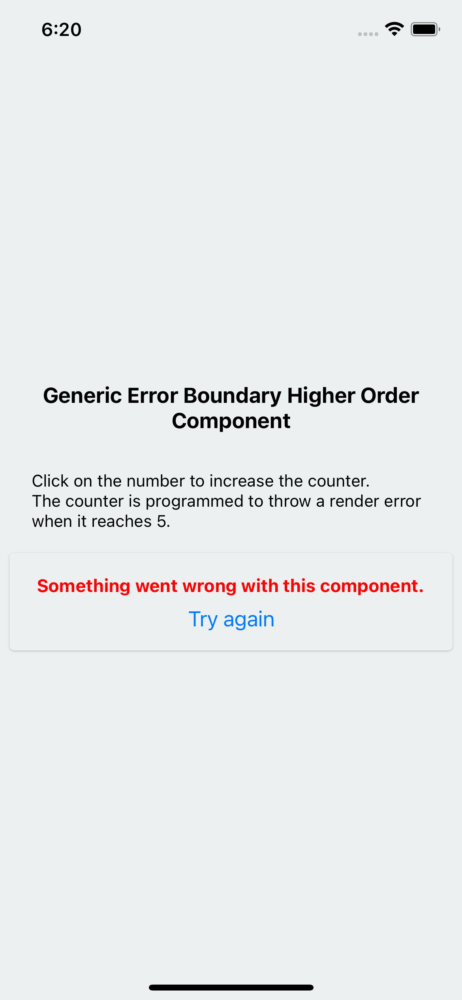
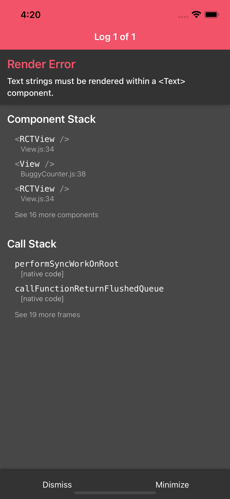

# Description
**withErrorBoundary.js** is the result of combining both the 
<a href = "https://reactjs.org/docs/higher-order-components.html">Higher-Order Components</a> 
with <a href = "https://reactjs.org/docs/error-boundaries.html">Error Boundaries</a> React's
patterns to make a simple and flexible solution for handling UI errors. You could 
just copy the source code from the repo or download the complete project and start 
playing around with it.

# Installation

Download or clone the source code, open your terminal in the project directory, 
do ***npm install*** (or ***yarn install***). Then, go to the ***ios*** folder 
(type ***cd ios*** in your terminal when already on the root directory) and do
***pod install*** (you must have Xcode installed from the App Store). Finally, 
go back to the root directory of the project (type ***cd ..***) and type 
***npm run ios*** in your terminal. If you did well, the Metro bundler will 
start building the app an then this will open your iOS simulator, install the 
app and run it.

### List of commands in order:

    $ git clone https://github.com/Kevwas/Generic-HOC-Error-Boundary.git
    $ cd Generic-HOC-Error-Boundary
    $ npm install 
    $ cd ios
    $ pod install
    $ cd ..
    $ npm run ios

# Usage

Import the **withErrorBoundary** HOC in the screen/component you want to add the
Error Boundaries capabilities and wrap the screen/component with this:

    // BuggyCounter.js
    import withErrorBoundary from './withErrorBoundary';

    ... BuggyCounter's code

    export default withErrorBoundary(BuggyCounter);

**BuggyCounter** is programmed to throw a render error when it reaches 5.

    import React, { useState } from 'react';
    import {
      Text, StyleSheet, Button, View,
    } from 'react-native';
    import CustomErrorComponent from './CustomErrorComponent';
    // Import the Error Boundary Higher Order Component
    import withErrorBoundary from './withErrorBoundary';

    const styles = StyleSheet.create({
      container: {
        alignItems: 'center',
        justifyContent: 'center',
        padding: 24,
        borderColor: 'gray',
        borderWidth: 0.5,
        borderRadius: 10,
      },
      number: {
        margin: 24,
        marginTop: 0,
        fontSize: 25,
        fontWeight: 'bold',
        textAlign: 'center',
      },
    });

    const BuggyCounter = () => {
      const [counter, setCounter] = useState(0);

      const handleClick = () => {
        setCounter((prevCounter) => prevCounter + 1);
      };

      return (
        <View style={styles.container}>
          {
            counter === 5
              && <View>
                This will cause a Render error, because text
                strings must be rendered within a Text component
              </View>
          }
          <Text style={styles.number}>
            {counter}
          </Text>
          <Button
            title="Increase counter"
            onPress={() => handleClick()}
          />
        </View>
      );
    };

    // Wrap the component with the ErrorBoundary HOC and export it
    export default withErrorBoundary(BuggyCounter, CustomErrorComponent);

# Custom Error Component/Screen

If you need to implement a custom error component (or screen), just create it 
and pass it as props through the **withErrorBoundary** HOC as follows:

    const CustomErrorComponent = () => (
      <View>
        <Text>
          Custom Error Component
        </Text>
      </View>
    );

    export default withErrorBoundary(BuggyCounter, CustomErrorComponent);

# Core: withErrorBoundary.js

    import React from 'react';
    import {
      Text, View, Button, StyleSheet,
    } from 'react-native';
    import PropTypes from 'prop-types';

    const styles = StyleSheet.create({
      container: {
        justifyContent: 'center',
        alignItems: 'center',
        marginTop: '3%',
      },
      text: {
        color: 'red',
        fontSize: 15,
        fontWeight: 'bold',
      },
    });

    function withErrorBoundary(WrappedComponent, CustomErrorScreen) {
      return class ErrorBoundary extends React.Component {
        constructor(props) {
          super(props);
          this.state = { hasError: false };
        }

        static getDerivedStateFromError() {
          // Update state so the next render will show the fallback UI.
          return { hasError: true };
        }

        // static componentDidCatch(error, errorInfo) {
          // You can also log the error to an error reporting service
          // logErrorToMyService(error, errorInfo);
          // Also, you could use navigation if an error is catched and go to another screen.
        // }

        render() {
          if (this.state.hasError) {
            // You can render any custom fallback UI
            // And also, this UI could have a navigation option button for returning to another screen
            if (CustomErrorScreen !== undefined) {
              return (
                <View style={styles.container}>
                  <CustomErrorScreen />
                  <Button
                    title="Try again"
                    onPress={() => this.setState({ hasError: false })}
                  />
                </View>
              );
            }
            return (
                <View style={styles.container}>
                  <Text style={styles.text}>Something went wrong with this component.</Text>
                  <Button
                    title="Try again"
                    onPress={() => this.setState({ hasError: false })}
                  />
                </View>
            );
          }

          // If everything works as expected, then, returns the wrapped screen/component
          return <WrappedComponent />;
        }
      };
    }
    withErrorBoundary.propTypes = {
      errorScreen: PropTypes.element,
    };

    export default withErrorBoundary;

# Screenshots

### Main
 

### UI custom error component
 

### UI default error component
 

### Console Error
 

# Demo

<a href = "https://snack.expo.dev/@kevwas/generic-hoc-error-boundary">https://snack.expo.dev/@kevwas/generic-hoc-error-boundary</a>
